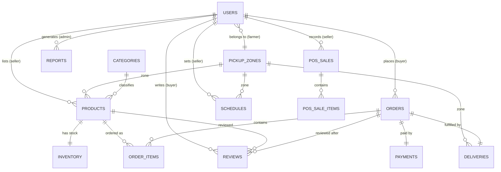
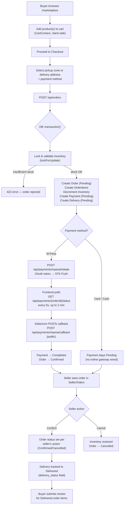

# SokoMoja — Farmer-to-Buyer Marketplace & POS

**SokoMoja** ("one market" in Swahili) is a full-stack web application that connects Kenyan smallholder farmers directly with buyers, cutting out layers of brokers in the produce supply chain. It combines an online marketplace (browse, cart, checkout, M-Pesa payment, delivery/pickup tracking) with a lightweight point-of-sale (POS) tool farmers can use to record walk-in/farm-gate cash sales, plus an administrative back office for verifying farmers, managing pickup zones, and monitoring platform-wide activity.

This document describes **only what is implemented in the current codebase** — no planned or assumed features.

---

## Table of Contents

1. [Project Overview](#1-project-overview)
2. [System Architecture](#2-system-architecture)
3. [Technologies Used](#3-technologies-used)
4. [Database Design](#4-database-design)
5. [User Roles](#5-user-roles)
6. [Authentication & Security](#6-authentication--security)
7. [Backend Features](#7-backend-features)
8. [Frontend Features](#8-frontend-features)
9. [API Endpoints](#9-api-endpoints)
10. [Order Workflow](#10-order-workflow)
11. [M-Pesa Integration](#11-m-pesa-integration)
12. [Admin Features](#12-admin-features)
13. [Seller Features](#13-seller-features)
14. [Buyer Features](#14-buyer-features)
15. [UI/UX Features](#15-uiux-features)
16. [Project Strengths](#16-project-strengths)
17. [Current Limitations](#17-current-limitations)
18. [Future Improvements](#18-future-improvements)
19. [Lessons Learned](#19-lessons-learned)
20. [Project Statistics](#20-project-statistics)
21. [Conclusion](#21-conclusion)

---

## 1. Project Overview

### What SokoMoja is

SokoMoja is a two-sided marketplace platform with three user roles — **Buyer**, **Seller (Farmer)**, and **Administrator** — built on a Laravel REST API backend and a React single-page-application frontend. Buyers browse fresh produce listed by verified farmers, add items to a cart, check out with pickup-zone or delivery-address selection, and pay via M-Pesa STK Push (or Card/Cash, recorded but not processed online). Farmers manage their own product listings, track inventory, view and confirm/cancel incoming orders, log offline POS sales, and set a weekly collection/delivery schedule. Administrators verify new farmer accounts, manage users and pickup zones, and view platform-wide analytics and reports.

### The problem it solves

In Kenya's produce supply chain, smallholder farmers typically sell through middlemen who capture much of the margin, while urban buyers pay a premium without knowing where their food comes from. SokoMoja gives farmers a direct online storefront and buyers a transparent way to buy straight from verified local farms, organized around **pickup zones** (regional collection points) rather than individual farm delivery.

### Target users

- **Buyers** — individuals or small businesses purchasing fresh produce online.
- **Sellers / Farmers** — smallholder farmers who list produce, must be verified by an admin before selling, and can also record informal cash sales made in person.
- **Administrators** — platform operators who verify farmers, manage pickup zones, oversee users, and monitor overall marketplace health.

### Overall workflow: registration to completed order

1. A user registers as `buyer`, `seller`, or `admin` via `POST /api/auth/register`.
2. Buyers are active immediately; **sellers start unverified** (`is_verified = false`) and cannot log in or list products until an admin verifies them.
3. Once verified, a farmer lists products (with initial stock via an `Inventory` record) and can view them appear on the public marketplace.
4. A buyer browses `/marketplace` (public, no login required), adds items to a cart (React Context, client-side only), and proceeds to checkout.
5. At checkout, the buyer selects a pickup zone or provides a delivery address and a payment method (M-Pesa, Card, or Cash), and submits the order.
6. The backend validates stock, creates the `Order`, `OrderItem`s, a `Payment` record, and a `Delivery` record in a single database transaction, decrementing inventory as it goes.
7. If M-Pesa was chosen, the frontend triggers an STK Push and polls the payment status until Safaricom's callback marks the payment `Completed` (which also flips the order to `Confirmed`).
8. The seller sees the new order in their dashboard and can **Confirm** or **Cancel** it (cancelling restores inventory).
9. Once fulfilled, an admin/seller flow tracks delivery status through to `Delivered`, after which the buyer can leave a product review for items in that order.

### Main objectives

- Give verified farmers a direct sales channel with inventory and order management.
- Give buyers a transparent, searchable marketplace with real-time stock and zone-based logistics.
- Give administrators the tools to police platform quality (farmer verification, user suspension, zone management) and visibility into overall performance.
- Support both **online orders** (through the marketplace) and **offline/farm-gate sales** (through the POS module) in one unified sales-reporting view.

---

## 2. System Architecture

### Overview

```
                     ┌───────────────────────────┐
                     │        Browser            │
                     │  (Buyer / Seller / Admin) │
                     └─────────────┬─────────────┘
                                   │  HTTP/HTTPS
                                   ▼
                     ┌───────────────────────────┐
                     │   React 19 + Vite SPA     │
                     │   (frontend/, port 5173)  │
                     │  - React Router v7        │
                     │  - CartContext (state)    │
                     │  - Bootstrap 5 (CDN)      │
                     └─────────────┬─────────────┘
                                   │  fetch() + Bearer JWT
                                   │  REST / JSON (utils/api.js)
                                   ▼
                     ┌───────────────────────────┐
                     │   Laravel 13 REST API     │
                     │   (backend/, port 8000)   │
                     │  - routes/api.php         │
                     │  - JWT auth guard         │
                     │  - RoleMiddleware         │
                     └─────────────┬─────────────┘
                                   │  Eloquent ORM
                                   ▼
                     ┌───────────────────────────┐
                     │        MySQL              │
                     │  (16 application tables)  │
                     └───────────────────────────┘

           ┌───────────────────────────────────────┐
           │  Safaricom Daraja (M-Pesa Sandbox/Prod) │
           │  OAuth → STK Push → Callback webhook    │
           └──────────────────┬──────────────────────┘
                              │  public callback route
                              ▼
                     MpesaController::callback()
```

### Frontend

A React 19 single-page application built with Vite. Routing is handled entirely client-side by `react-router-dom` v7 (`frontend/src/App.jsx`). There is no server-side rendering. Bootstrap 5 and Bootstrap Icons are loaded via CDN `<link>`/`<script>` tags in `index.html` (not installed as npm packages) for layout/components, with a custom design-token stylesheet (`src/styles/index.css`) layered on top for SokoMoja-specific branding (green color palette, cards, sidebar, etc.).

### Backend

A Laravel 13 (PHP 8.3) REST API. All application logic lives under `app/Http/Controllers/Api/`, with no server-rendered views except the default Laravel welcome page at `/`. Every endpoint returns JSON. Controllers talk to the database exclusively through Eloquent models in `app/Models/`.

### Database

MySQL (`DB_CONNECTION=mysql` in `backend/.env`), accessed via Laravel migrations and Eloquent. Most tables use custom, domain-specific primary keys (e.g. `order_id`, `product_id`) rather than Laravel's default `id`.

### Authentication

Stateless JWT authentication via the `php-open-source-saver/jwt-auth` package, configured as the default `api` guard (`config/auth.php`). The frontend stores the JWT in `localStorage` and attaches it as a `Bearer` token on every authenticated request (`frontend/src/utils/api.js`). `laravel/sanctum` is present in `composer.json` and has a `personal_access_tokens` migration, but it is **not actually wired into any authentication flow** — JWT is the sole auth mechanism in use.

### API communication

The frontend's `apiRequest()` helper (`frontend/src/utils/api.js`) centralizes all HTTP calls to a hardcoded base URL (`http://localhost:8000/api`), automatically attaching the JWT and parsing Laravel's JSON error/validation responses. A separate `apiUpload()` helper handles `multipart/form-data` requests for avatar image uploads.

### Folder structure

```
farm-marketplace-pos/
├── backend/                       Laravel 13 API
│   ├── app/
│   │   ├── Http/
│   │   │   ├── Controllers/Api/   18 REST controllers
│   │   │   └── Middleware/        RoleMiddleware (role-based access)
│   │   └── Models/                15 Eloquent models
│   ├── config/                    auth, mpesa, sokomoja (custom), sanctum, jwt, ...
│   ├── database/
│   │   ├── migrations/            23 migration files
│   │   ├── seeders/                Demo data (users, products, orders, reviews, zones)
│   │   └── factories/
│   ├── routes/
│   │   ├── api.php                All REST endpoints
│   │   └── web.php                Single default welcome route
│   └── tests/                     Default Laravel scaffold tests only (unused)
│
└── frontend/                      React 19 + Vite SPA
    └── src/
        ├── pages/
        │   ├── buyer/              5 buyer pages
        │   ├── seller/             8 seller/farmer pages
        │   ├── admin/              6 admin pages
        │   └── *.jsx                Landing, Marketplace, Login, Register, ForgotPassword, NotFound
        ├── components/            13 shared UI components
        ├── context/                CartContext (global cart state)
        ├── utils/                  api.js (HTTP helper), auth.js (JWT/localStorage helper)
        └── styles/index.css        Design tokens + custom styling
```

---

## 3. Technologies Used

| Technology | Purpose | Version |
|---|---|---|
| **Laravel** | Backend REST API framework — routing, Eloquent ORM, validation, middleware | ^13.8 (installed 13.15.0) |
| **PHP** | Backend runtime language | ^8.3 |
| **php-open-source-saver/jwt-auth** | Stateless JWT authentication for the API guard | ^2.9 |
| **laravel/sanctum** | Installed dependency (personal_access_tokens table exists) but not used for actual auth | ^4.0 |
| **MySQL** | Relational database for all application data | via `DB_CONNECTION=mysql` |
| **React** | Frontend UI library — component-based SPA | ^19.2.6 |
| **React Router** | Client-side routing between public/buyer/seller/admin pages | ^7.17.0 |
| **Vite** | Frontend dev server and build tool | ^8.0.12 |
| **Bootstrap 5** | Grid, layout, forms, buttons, cards (via CDN, not npm) | 5.3.3 |
| **Bootstrap Icons** | Icon set used across sidebars, buttons, and cards (via CDN) | 1.11.3 |
| **lucide-react** | Additional icon components used in some pages | ^1.18.0 |
| **JavaScript (ES Modules)** | Frontend application logic | — |
| **HTML5 / CSS3** | Markup and custom design tokens/styling | — |
| **Composer** | PHP dependency management | — |
| **NPM** | JavaScript dependency management | — |
| **Git** | Version control | — |
| **Safaricom Daraja API (M-Pesa)** | STK Push mobile payment integration (sandbox by default) | v1 (OAuth + STK Push) |

**Why these choices:** Laravel gives the project a batteries-included REST framework (validation, Eloquent, migrations, middleware) well suited to a relational, transaction-heavy domain (orders/payments/inventory). JWT was chosen over Laravel's session-based auth or Sanctum's cookie flow because the frontend is a fully decoupled SPA that needs a portable, stateless bearer token. React + Vite gives fast dev iteration and a component model that maps naturally to the three distinct dashboards (buyer/seller/admin). Bootstrap via CDN avoids adding a large npm dependency while still providing a consistent, responsive component library quickly, layered under a custom green-toned design-token stylesheet for brand identity.

---

## 4. Database Design

All tables below are defined in `backend/database/migrations/`. Most use custom primary key names matching their domain concept (e.g. `product_id` instead of `id`).

### `users`
- **PK:** `user_id`
- **Purpose:** Stores all three account types (buyer, seller, admin) in a single table.
- **Key columns:** `name`, `email` (unique), `password` (hashed), `phone_number`, `role` (enum: buyer/seller/admin), `region`, `avatar_url`, `zone_id` (FK, farmer's pickup zone), `is_verified` (bool — farmers must be admin-verified before selling), `status` (enum: active/suspended).
- **Relationships:** belongs to one `pickup_zones` (via `zone_id`); has many `products` (as seller), `orders` (as buyer).

### `pickup_zones`
- **PK:** `zone_id`
- **Purpose:** Regional collection/delivery points used for logistics and to group farmers and buyers by area.
- **Key columns:** `zone_name`, `pickup_address`, `region`. No timestamps.
- **Relationships:** has many `users` (farmers, filtered by `role = seller`), has many `deliveries`.

### `categories`
- **PK:** `category_id`
- **Purpose:** Product taxonomy (e.g. Vegetables, Fruits).
- **Key columns:** `name` (unique), `slug` (unique), `description`.
- **Relationships:** has many `products`.

### `products`
- **PK:** `product_id`
- **Purpose:** Produce listings created by verified sellers.
- **Key columns:** `seller_id` (FK → users, cascade delete), `category_id` (FK → categories), `zone_id` (FK → pickup_zones, nullable), `name`, `description`, `price`, `unit` (kg/bunch/piece/litre/crate/bag/dozen), `bunch_contains` (free-text clarifying quantity, e.g. "Approx 500g"), `image_url`, `status` (active/inactive).
- **Relationships:** belongs to `seller` (user), `category`, `zone`; has one `inventory`; has many `reviews`.

### `inventory`
- **PK:** `inventory_id`
- **Purpose:** Stock levels per product (one-to-one with products).
- **Key columns:** `product_id` (FK, unique — cascade delete), `quantity_available` (decimal), `low_stock_threshold` (decimal, default 10).
- **Relationships:** belongs to `product`.

### `orders`
- **PK:** `order_id`
- **Purpose:** A buyer's checkout transaction, potentially spanning multiple sellers' products.
- **Key columns:** `buyer_id` (FK → users, cascade delete), `total_amount`, `order_status` (enum: Pending/Confirmed/Delivered/Cancelled, default Pending), `order_date` (defaults to current timestamp).
- **Relationships:** belongs to `buyer`; has many `order_items`; has one `payment`; has one `delivery`.

### `order_items`
- **PK:** `order_item_id`
- **Purpose:** Line items within an order (no timestamps).
- **Key columns:** `order_id` (FK, cascade delete), `product_id` (FK), `quantity`, `unit_price`, `subtotal`.
- **Relationships:** belongs to `order`, `product`.

### `payments`
- **PK:** `payment_id`
- **Purpose:** One payment record per order (1:1), tracking M-Pesa STK Push state.
- **Key columns:** `order_id` (FK, unique, cascade delete), `payment_method` (enum: M-Pesa/Card/Cash), `amount`, `payment_status` (enum: Pending/Completed/Failed), `phone_number`, `mpesa_checkout_request_id`, `mpesa_receipt_number`, `payment_date`.
- **Relationships:** belongs to `order`.

### `deliveries`
- **PK:** `delivery_id`
- **Purpose:** Fulfillment record per order — either pickup-zone collection or a direct delivery address.
- **Key columns:** `order_id` (FK, unique, cascade delete), `zone_id` (FK, nullable, `nullOnDelete`), `delivery_address`, `delivery_status` (enum: Pending/In Transit/Delivered, default Pending), `delivery_date`.
- **Relationships:** belongs to `order`, `pickupZone`.

### `reviews`
- **PK:** `review_id`
- **Purpose:** Buyer reviews of individual products, tied to the specific order they were purchased in. **This is the review system actually used by `ReviewController` and shown on product pages.**
- **Key columns:** `order_id` (FK, cascade delete), `buyer_id` (FK, cascade delete), `product_id` (FK, cascade delete), `rating` (1–5), `comment`, `created_at` only (no `updated_at`). Unique constraint on `(order_id, product_id)` — one review per product per order.
- **Relationships:** belongs to `order`, `buyer`, `product`.

### `product_reviews`
- **PK:** `review_id`
- **Purpose:** A separate reviews table (buyer + product + rating, unique per buyer/product pair) defined by its own migration and `ProductReview` model. **Not referenced by any controller or route** — appears to be superseded by the `reviews` table above and is currently dead schema.

### `pos_sales`
- **PK:** `sale_id`
- **Purpose:** Offline/farm-gate cash sales recorded directly by a farmer (point-of-sale), independent of the online order flow.
- **Key columns:** `seller_id` (FK, cascade delete), `buyer_name` (nullable — "walk-in buyer" if absent), `payment_method` (enum: Cash/M-Pesa), `total_amount`, `sale_date`.
- **Relationships:** belongs to `seller` (user); has many `pos_sale_items`.

### `pos_sale_items`
- **PK:** `pos_item_id`
- **Purpose:** Line items within a POS sale (no timestamps).
- **Key columns:** `sale_id` (FK, cascade delete), `product_name` (free text, not linked to `products`), `quantity`, `unit`, `unit_price`, `subtotal`.
- **Relationships:** belongs to `sale`.

### `schedules`
- **PK:** `schedule_id`
- **Purpose:** A farmer's recurring weekly collection/delivery schedule (e.g. "Every Tuesday at 09:00, Kiambu zone").
- **Key columns:** `seller_id` (FK, cascade delete), `day` (enum Mon–Sun), `arrival_time` (time), `notes`, `zone_id` (FK, nullable).
- **Relationships:** belongs to `seller` (user), `zone`.

### `reports`
- **PK:** `report_id`
- **Purpose:** Records of admin-generated reports (metadata only — see [Limitations](#17-current-limitations)).
- **Key columns:** `admin_id` (FK, cascade delete), `report_type` (Sales summary / Inventory / User activity / Zone performance), `parameters` (JSON), `generated_date`.
- **Relationships:** belongs to `admin` (user).

### `personal_access_tokens`, `jobs`, `sessions`, `cache`, `cache_locks`
Standard Laravel framework tables (Sanctum tokens, queue jobs, session driver, cache driver). Present in migrations but not exercised by any custom business logic beyond framework defaults.

### Entity relationship diagram



---

## 5. User Roles

### Buyer
- **Permissions:** Browse public marketplace, register/log in, manage own profile & avatar, place orders, pay via M-Pesa/Card/Cash, view own order history and tracking, submit one review per product per delivered order.
- **Restrictions:** Cannot access seller or admin routes (`role:buyer` / `ProtectedRoute` enforced both server- and client-side). Can only see/act on their own orders (`buyer_id = auth()->id()` scoping in every query).
- **Dashboard:** `/buyer/dashboard` — browse/search products, view cart.
- **Typical workflow:** Register → browse marketplace → add to cart → checkout (select zone/address + payment method) → pay via M-Pesa → track order → leave a review once delivered.

### Seller (Farmer)
- **Permissions:** Once `is_verified = true`, can list/update products, manage stock (`inventory`), view and confirm/cancel incoming orders containing their products, record offline POS sales, set a weekly collection schedule, view a sales/summary dashboard, manage own profile & avatar.
- **Restrictions:** Unverified sellers **cannot log in at all** (blocked at `AuthController::login`) and cannot list products (blocked at `SellerProductController::store`) even if somehow authenticated. All seller endpoints scope data to `seller_id = auth()->id()` or products/orders belonging to them.
- **Dashboard:** `/seller/dashboard` — sales summary, weekly sales chart, pending orders, active listings, average rating.
- **Typical workflow:** Register as seller → wait for admin verification → list products with initial stock → receive orders → confirm/cancel → fulfill via pickup zone/schedule → also log any walk-in cash sales via POS.

### Administrator
- **Permissions:** View platform overview/analytics, manage all users (search/filter, suspend/activate, verify/unverify farmers, reset passwords), manage pickup zones (create/update/delete), view detailed farmer profiles, generate/view reports, create additional admin accounts, manage own profile/password.
- **Restrictions:** Cannot suspend their own account (explicit check in `AdminUserController::updateStatus`). Zone deletion blocked while farmers or products still reference the zone.
- **Dashboard:** `/admin/overview` — platform-wide KPIs (users, farmers, orders, revenue, order-status breakdown, top categories).
- **Typical workflow:** Review newly registered farmers → verify legitimate ones → monitor overview metrics → manage zones as coverage expands → suspend abusive accounts → generate reports as needed.

---

## 6. Authentication & Security

- **JWT authentication:** All protected endpoints require `Authorization: Bearer <token>`, verified by the `auth:api` middleware group, which uses the JWT guard (`php-open-source-saver/jwt-auth`). Tokens are issued on register/login (`JWTAuth::fromUser($user)`), can be refreshed (`POST /api/auth/refresh`), and invalidated on logout (`JWTAuth::invalidate`).
- **Protected routes:** Routes are grouped under `Route::middleware('auth:api')` for any logged-in user, then further nested under `role:buyer`, `role:seller`, or `role:admin` groups in `routes/api.php`.
- **Role middleware:** `app/Http/Middleware/RoleMiddleware.php` checks `auth()->user()->role` against the roles passed to `role:...` in the route definition, returning `403` if the user's role isn't in the allowed list.
- **Authorization / ownership checks:** Controllers consistently scope queries to the authenticated user — e.g. `Order::where('buyer_id', auth()->id())`, `Product::where('seller_id', auth()->id())`, `Inventory::whereHas('product', fn($q) => $q->where('seller_id', auth()->id()))` — preventing cross-account data access even within the same role.
- **Password hashing:** `Hash::make()` (bcrypt, `BCRYPT_ROUNDS=12`) on registration, admin-created accounts, and password resets; `Hash::check()` on login and password change.
- **Validation:** Every write endpoint uses Laravel's `Validator` with explicit rules (types, `exists:` checks against related tables, `unique:` constraints, enum `in:` lists) and returns a consistent `422` shape: `{ message, errors }`.
- **Admin permissions:** Enforced entirely through the `role:admin` middleware group; no separate permission/ability system exists beyond the three-role model.
- **Seller verification:** New sellers are created with `is_verified = false`. `AuthController::login` blocks login for unverified sellers with a 403 and explanatory message. `SellerProductController::store` also blocks product creation for unverified sellers as defense-in-depth. Admin verifies via `PATCH /api/admin/users/{id}/verify`; can also revoke verification via `PATCH /api/admin/farmers/{id}/unverify`.
- **Suspended users:** `users.status` is `active` or `suspended`. `AuthController::login` blocks suspended accounts with a 403. Admins toggle status via `PATCH /api/admin/users/{id}` and cannot suspend themselves.
- **API protection / error shape:** `bootstrap/app.php` registers exception renderers so `AuthenticationException`, `AuthorizationException`, and `NotFoundHttpException` all return consistent JSON (`401`/`403`/`404`) instead of HTML/redirects, matching the SPA's expectations.
- **File upload validation:** Avatar uploads (`ProfileController`, `AdminProfileController`) validate `image|mimes:jpeg,jpg,png,webp|max:2048` and delete the previous file from storage before saving the new one.

---

## 7. Backend Features

Eighteen controllers under `app/Http/Controllers/Api/`:

- **AuthController** — register (role-aware defaults, e.g. sellers unverified), login (with suspended/unverified checks), logout, `me`, token refresh. Returns a consistently shaped `user` object including nested `zone`.
- **ProfileController** — any authenticated user's own profile: view, update (name/email/phone/region/zone_id), avatar upload/removal.
- **AdminProfileController** — admin's own profile view/update, avatar upload, password change (requires current password), and admin account creation (`POST /admin/users/create`).
- **AdminUserController** — paginated user listing with search (name/email) and role filter; suspend/activate; verify farmers; reset a user's password to the configured default (`config('sokomoja.default_user_password')`).
- **AdminFarmerController** — detailed farmer profile view for admins, aggregating product counts, fulfilled-order counts, average rating, and recent products/reviews in one response; and unverify.
- **AdminReportController** — platform overview (user/farmer/buyer counts, verified-farmer count, order-status breakdown, total revenue from completed payments, top 3 categories by order volume, new users this month); paginated report listing; report creation (stores type + JSON parameters, no generated file/export).
- **PickupZoneController** — public zone listing (with optional region filter, used by Register/Profile dropdowns); admin CRUD (create/update/delete, with delete blocked if farmers/products still reference the zone) and an admin listing annotated with farmer counts.
- **ProductController** — public product browsing: search (name/description), category/zone/price-range filters, sort (`newest`/`price_asc`/`price_desc`), pagination (capped at 50/page); single product detail including reviews and average rating; category listing with active-product counts. Only shows products from `active`, `is_verified` sellers.
- **SellerProductController** — seller's own product listing, creation (blocked if unverified; also creates the paired `Inventory` row), and update.
- **SellerInventoryController** — seller's inventory listing (annotated with a computed `stock_status`: `out_of_stock`/`low_stock`/`in_stock`) and stock-level updates.
- **OrderController** — order placement (`store`) wraps stock validation, order/order-items/payment/delivery creation in one `DB::transaction` with row-level locking (`lockForUpdate`) on inventory to prevent overselling; buyer's order listing (with status filter, paginated) and single-order detail.
- **SellerOrderController** — seller's view of orders containing their products (filtered per-item, not whole orders); status update restricted to `Pending → Confirmed/Cancelled`, with inventory automatically restored on cancellation.
- **MpesaController** — STK Push initiation (OAuth token fetch → push request → stores `CheckoutRequestID`), public callback handler (updates payment/order status from Safaricom's webhook), and a status-polling endpoint for the frontend.
- **SellerSalesController** — POS sale listing (paginated, with today/total revenue and count summaries) and sale recording (multi-item, computes subtotals/total in a transaction).
- **SellerScheduleController** — weekly schedule listing (ordered Mon→Sun via `FIELD()`), creation, and deletion (ownership-checked).
- **SellerSummaryController** — seller dashboard aggregate: total completed-payment sales, count of in-stock listings, pending-order count, average product rating, and a 7-day (Mon–Sun) sales series combining both online (order/payment) and offline (POS) revenue per day.
- **ReviewController** — review submission (validates the order belongs to the buyer, is `Delivered`, the product was actually in that order, and no duplicate review exists) and public per-product review listing with average rating.
- **Controller** (base) — empty base class all controllers extend.

**Cross-cutting patterns:**
- **Response format:** Nearly every endpoint returns `{ data: ..., message?: ... }`, with paginated endpoints adding `meta` (`total`, `current_page`, `last_page`) or wrapping with Laravel's `->through()` on the paginator.
- **Database transactions:** Order placement and POS sale recording both use `DB::transaction()` to guarantee atomicity across multiple table writes.
- **Pagination:** Used consistently for lists (`products` 12/page default, `orders` 10/page, `admin/users` 20/page, `admin/reports` 15/page, `seller/sales` 15/page).
- **Filtering & search:** `LIKE` search on products (name/description) and users (name/email); exact filters on category/zone/price-range/status/role.
- **Validation:** Every mutating endpoint validates input before touching the database.

---

## 8. Frontend Features

### Public pages
- **LandingPage** (`/`) — marketing homepage composed of `Hero`, `HowItWorks`, `RoleCards`, `ZonesSection`, and `Footer` components.
- **PublicMarketplace** (`/marketplace`) — the full product browsing experience (search, filters, sort, pagination, add-to-cart) available **without login**.
- **LoginPage** (`/login`) — email/password login; on success stores JWT + user via `utils/auth.js` and redirects by role.
- **RegisterPage** (`/register`) — role selection (buyer/seller/admin) with conditional fields (zone selection for sellers), pickup-zone dropdown fetched from the public endpoint.
- **ForgotPassword** (`/forgot-password`) — password-recovery UI (see [Limitations](#17-current-limitations) for backend status).
- **NotFound** (`*`) — catch-all 404 page.

### Buyer pages
- **BuyerDashboard** (`/buyer/dashboard`) — the buyer's product-browsing home with cart integration.
- **Checkout** (`/buyer/checkout`) — loads pickup zones, places the order, and for M-Pesa polls payment status every 5 seconds up to a 2-minute timeout.
- **MyOrders** (`/buyer/orders`) — order history with status filter and pagination, backed by the real API.
- **OrderTracking** (`/buyer/orders/:orderId`) — single-order detail including items, payment, and delivery/zone status.
- **BuyerProfile** (`/buyer/profile`) — profile editing and avatar management.

### Seller pages
- **SellerDashboard** (`/seller/dashboard`) — summary cards + weekly sales chart from `SellerSummaryController`.
- **SellerProducts** (`/seller/products`) — the seller's product catalog with edit access.
- **SellerAddProduct** (`/seller/products/add`) — new listing form (name, category, price, unit, `bunch_contains`, initial stock, threshold).
- **FarmerInventory** (`/seller/inventory`) — stock levels with computed status badges (in/low/out of stock).
- **FarmerSales** (`/seller/sales`) — POS sale entry form and sale history with revenue summaries.
- **FarmerSchedule** (`/seller/schedule`) — weekly collection/delivery schedule management.
- **SellerOrders** (`/seller/orders`) — incoming orders with confirm/cancel actions wired to the API.
- **SellerProfile** (`/seller/profile`) — profile editing and avatar management.

### Admin pages
- **AdminOverview** (`/admin/overview`) — platform KPIs, order-status breakdown, top categories.
- **AdminUsers** (`/admin/users`) — searchable/filterable user table with suspend/activate, verify, and reset-password actions.
- **AdminZones** (`/admin/zones`) — pickup-zone CRUD with farmer counts.
- **AdminReports** (`/admin/reports`) — report generation form and paginated report history.
- **AdminProfile** (`/admin/profile`) — admin's own profile, avatar, password change, and new-admin creation form.
- **AdminFarmerDetail** (`/admin/farmers/:farmerId`) — deep-dive farmer profile with stats, recent products, and recent reviews; unverify action.

### Navigation
Routing is defined once in `App.jsx` using `react-router-dom`. `ProtectedRoute` guards every buyer/seller/admin route: unauthenticated users are redirected to `/login`; authenticated users whose role doesn't match the route's `allowedRoles` are redirected to their own role's home dashboard (`ROLE_HOME` map). Within each dashboard, `DashboardLayout` renders a shared sidebar (role-specific `navItems`) and topbar (avatar/name/role, mobile hamburger, sidebar collapse toggle) around the page content.

---

## 9. API Endpoints

All endpoints are prefixed with `/api`. Auth = whether `auth:api` (JWT) is required. Role = additional `role:` middleware restriction, if any.

| Method | Endpoint | Auth | Role | Purpose |
|---|---|---|---|---|
| POST | `/auth/register` | No | — | Register a buyer/seller/admin account |
| POST | `/auth/login` | No | — | Authenticate and receive a JWT |
| POST | `/auth/logout` | Yes | any | Invalidate current JWT |
| GET | `/auth/me` | Yes | any | Get current authenticated user |
| POST | `/auth/refresh` | Yes | any | Exchange a token for a fresh one |
| GET | `/pickup-zones` | No | — | List pickup zones (public dropdown) |
| POST | `/payments/mpesa/callback` | No | — | Safaricom webhook — payment result |
| GET | `/categories` | No | — | List product categories with counts |
| GET | `/products` | No | — | Browse products (search/filter/sort/paginate) |
| GET | `/products/{id}` | No | — | Single product detail + reviews |
| GET | `/products/{productId}/reviews` | No | — | Paginated reviews for a product |
| GET | `/profile` | Yes | any | View own profile |
| PATCH | `/profile` | Yes | any | Update own profile |
| POST | `/profile/avatar` | Yes | any | Upload profile avatar |
| DELETE | `/profile/avatar` | Yes | any | Remove profile avatar |
| POST | `/orders` | Yes | buyer | Place a new order |
| GET | `/orders` | Yes | buyer | List own orders (filter/paginate) |
| GET | `/orders/{id}` | Yes | buyer | View own order detail |
| POST | `/payments/mpesa/initiate` | Yes | buyer | Trigger STK Push for an order |
| GET | `/payments/{orderId}/status` | Yes | buyer | Poll payment/order status |
| POST | `/reviews` | Yes | buyer | Submit a product review |
| GET | `/seller/products` | Yes | seller | List own product listings |
| POST | `/seller/products` | Yes | seller | Create a new product listing |
| PATCH | `/seller/products/{id}` | Yes | seller | Update own product listing |
| GET | `/seller/inventory` | Yes | seller | View own stock levels |
| PATCH | `/seller/inventory/{id}` | Yes | seller | Update stock quantity/threshold |
| GET | `/seller/orders` | Yes | seller | List orders containing own products |
| PATCH | `/seller/orders/{id}` | Yes | seller | Confirm or cancel a pending order |
| GET | `/seller/summary` | Yes | seller | Dashboard KPIs + weekly sales |
| GET | `/seller/sales` | Yes | seller | List own POS sales |
| POST | `/seller/sales` | Yes | seller | Record a new POS sale |
| GET | `/seller/schedule` | Yes | seller | List own weekly schedule |
| POST | `/seller/schedule` | Yes | seller | Add a schedule entry |
| DELETE | `/seller/schedule/{id}` | Yes | seller | Remove a schedule entry |
| GET | `/admin/users` | Yes | admin | List/search/filter all users |
| PATCH | `/admin/users/{id}` | Yes | admin | Suspend or activate a user |
| PATCH | `/admin/users/{id}/verify` | Yes | admin | Verify a farmer account |
| POST | `/admin/users/{id}/reset-password` | Yes | admin | Reset a user's password to default |
| GET | `/admin/zones` | Yes | admin | List zones with farmer counts |
| POST | `/admin/zones` | Yes | admin | Create a pickup zone |
| PATCH | `/admin/zones/{id}` | Yes | admin | Update a pickup zone |
| DELETE | `/admin/zones/{id}` | Yes | admin | Delete a pickup zone (if unreferenced) |
| GET | `/admin/overview` | Yes | admin | Platform-wide KPI dashboard |
| GET | `/admin/reports` | Yes | admin | List generated reports |
| POST | `/admin/reports` | Yes | admin | Create a report record |
| GET | `/admin/profile` | Yes | admin | View own admin profile |
| PATCH | `/admin/profile` | Yes | admin | Update own admin profile |
| POST | `/admin/profile/avatar` | Yes | admin | Upload admin avatar |
| POST | `/admin/profile/password` | Yes | admin | Change own admin password |
| POST | `/admin/users/create` | Yes | admin | Create a new administrator account |
| GET | `/admin/farmers/{id}` | Yes | admin | Detailed farmer profile + stats |
| PATCH | `/admin/farmers/{id}/unverify` | Yes | admin | Revoke a farmer's verification |

---

## 10. Order Workflow



Key implementation notes:
- Order creation, item creation, inventory decrement, payment record, and delivery record are all created **inside one transaction** (`OrderController::store`), with `lockForUpdate()` on the inventory rows to avoid race conditions between simultaneous buyers.
- The seller's confirm/cancel action (`SellerOrderController::update`) is restricted to orders currently `Pending`; cancelling automatically increments inventory back.
- `delivery_status` (Pending/In Transit/Delivered) is a field on the `deliveries` table but the codebase does not expose an endpoint for sellers/admins to transition it — it is set to `Pending` at order creation and not otherwise updated by any controller found in this codebase.
- Reviews require the order to be `Delivered`, and are limited to products actually present in that order, with one review per product per order enforced by a unique DB constraint.

---

## 11. M-Pesa Integration

Implemented in `MpesaController` with configuration in `config/mpesa.php`.

- **OAuth:** `getOAuthToken()` calls the Daraja OAuth endpoint with HTTP Basic Auth (`consumer_key`/`consumer_secret`) to obtain a bearer access token before every STK Push.
- **STK Push:** `initiate()` validates the order belongs to the requesting buyer and has an associated payment, formats the phone number to `2547XXXXXXXX`/`2541XXXXXXXX`, builds the STK Push payload (`BusinessShortCode`, `Password` = base64(`shortcode+passkey+timestamp`), `Amount`, `PartyA`/`PartyB`, `CallBackURL`, `AccountReference`, `TransactionDesc`), and posts it to Daraja. The returned `CheckoutRequestID` is stored on the payment row.
- **Callback:** `callback()` is a **public** route (Safaricom must reach it without auth) that reads `Body.stkCallback`, matches the payment by `CheckoutRequestID`, and on `ResultCode === 0` marks the payment `Completed` (storing the `MpesaReceiptNumber` from the callback metadata) and the order `Confirmed`; any other result code marks the payment `Failed`.
- **Payment status polling:** `status($orderId)` returns the current `order_status` and `payment_status` for a buyer's own order; the frontend (`Checkout.jsx`) polls this every 5 seconds for up to 2 minutes after initiating STK Push.
- **Order confirmation:** Handled implicitly by the callback updating `order_status` to `Confirmed` — there is no separate confirmation step.
- **Sandbox configuration:** `config/mpesa.php` switches between sandbox and production Daraja URLs based on `MPESA_ENV` (defaults to `sandbox`). The project's `.env` is configured for sandbox (`MPESA_SHORTCODE=174379`, `MPESA_ENV=sandbox`) with the callback URL pointed at an ngrok tunnel for local development.
- **Required environment variables:** `MPESA_CONSUMER_KEY`, `MPESA_CONSUMER_SECRET`, `MPESA_SHORTCODE`, `MPESA_PASSKEY`, `MPESA_CALLBACK_URL`, `MPESA_ENV`.

Card and Cash are accepted as `payment_method` values on order creation but have no corresponding processing logic — they create a `Payment` row that stays `Pending` unless manually reconciled.

---

## 12. Admin Features

- **Overview Dashboard** — total users/farmers/buyers, verified-farmer count, total orders, order-status breakdown, total revenue (sum of completed payments), top 3 categories by order volume, new users this month (`AdminReportController::overview`).
- **Manage Users** — searchable (name/email), filterable by role, paginated table (`AdminUserController::index`).
- **Suspend / Activate Users** — toggles `status`; blocked from targeting one's own account.
- **Verify Farmers** — sets `is_verified = true`, unlocking login and product listing for that seller.
- **Unverify Farmers** — revokes verification via the dedicated `AdminFarmerController::unverify` endpoint.
- **Create Admin** — `AdminProfileController::createAdmin` creates a new pre-verified, active admin account.
- **Manage Pickup Zones** — create, update, delete (delete blocked while farmers/products still reference the zone), and a list annotated with farmer counts.
- **Reports** — create a report record (`report_type` + JSON `parameters`) and list previously generated reports; no file/PDF/CSV export is generated (see [Limitations](#17-current-limitations)).
- **View Farmer Profile** — `AdminFarmerDetail` page shows a farmer's stats (total/active products, fulfilled orders, average rating, review count) and recent products/reviews.
- **Manage Own Profile** — name/email/phone update, avatar upload, password change (current-password verified).
- **Reset User Passwords** — `POST /admin/users/{id}/reset-password` resets any user's password to a configurable default value (`config('sokomoja.default_user_password')`, default `SokoMoja2026!`), returned in the response for the admin to relay to the user.

---

## 13. Seller Features

- **Products** — create and update listings (name, category, price, unit, `bunch_contains`, image URL, status); creation blocked until admin-verified.
- **Inventory** — view stock with a computed status (`in_stock`/`low_stock`/`out_of_stock` based on `low_stock_threshold`) and update quantity/threshold.
- **Orders** — view orders containing the seller's products (with buyer info, items, payment, and pickup zone), confirm or cancel pending orders (cancellation restores stock).
- **Sales (POS)** — record walk-in/cash sales with multiple line items (product name, quantity, unit, unit price), view sale history with today/total revenue summaries.
- **Scheduling** — maintain a weekly recurring collection/delivery schedule (day, arrival time, notes, zone), add/remove entries.
- **Dashboard summary** — total completed-payment revenue, active-listing count, pending-order count, average product rating, and a combined online+offline 7-day sales chart.
- **Reviews** — sellers do not write reviews but their products' average rating and review counts feed into their dashboard and public profile stats.
- **Profile** — update contact details/region/zone, manage avatar.

---

## 14. Buyer Features

- **Browse** — public marketplace with no login required.
- **Search** — text search across product name and description.
- **Filter** — by category, pickup zone, and min/max price.
- **Sort** — newest, price ascending, price descending.
- **Cart** — client-side only (`CartContext`), persists for the session (not saved to backend or localStorage).
- **Checkout** — choose a pickup zone or provide a delivery address, choose a payment method, place the order.
- **Payments** — M-Pesa STK Push with live status polling; Card/Cash accepted as a method but not processed online.
- **Track Orders** — order history with status filtering and pagination; per-order tracking page showing items, payment status, and delivery/zone info.
- **Reviews** — submit a 1–5 star rating with an optional comment for any product in a `Delivered` order, once per product per order.
- **Profile** — update contact details/region, manage avatar.

---

## 15. UI/UX Features

- **Responsive layout** — Bootstrap 5 grid/utilities throughout, with `DashboardLayout`'s sidebar collapsing on desktop and becoming a slide-in overlay drawer on mobile (hamburger toggle).
- **Cards** — used extensively for product listings, orders, users, zones, and dashboard KPI tiles.
- **Sidebar** — role-specific navigation (`navItems` passed into `DashboardLayout`) with Bootstrap Icons per item and an active-route highlight.
- **Navbar** — public-facing top navigation on marketing/marketplace pages (`components/Navbar.jsx`).
- **Hero section** — landing-page hero (`components/Hero.jsx`) with supporting `HowItWorks`, `RoleCards`, and `ZonesSection` sections.
- **Icons** — Bootstrap Icons (`bi bi-*` classes) plus `lucide-react` components.
- **Empty / loading states** — pages fetch data with local loading flags and render placeholder/empty-state messaging while waiting on or lacking API data (e.g. "no orders yet").
- **Alerts / Toasts** — `components/Toast.jsx` provides lightweight success/error notifications; form pages also render inline Bootstrap alert banners for validation errors.
- **Badges** — stock-status and order/payment-status badges (color-coded via Bootstrap badge classes).
- **Pagination** — `components/PaginationBar.jsx` is a shared, reusable pagination control used across product, order, user, and report lists.
- **Search bar** — `components/SearchBar.jsx` shared component used on the marketplace.
- **Image handling** — product/avatar images are stored/served from Laravel's public disk and returned as absolute URLs (`Product::imageUrl` accessor, `url($user->avatar_url)` in controllers) so the frontend never needs to know the API host.
- **Product cards / review cards** — `ReviewCard.jsx` renders star ratings, buyer name, and comment consistently wherever reviews are shown.
- **Theme / colors** — a dedicated green-toned design-token system in `styles/index.css` (`--sm-green`, `--sm-green-dark`, etc.) layered on top of Bootstrap for a distinct SokoMoja brand identity, plus consistent shadow/radius/transition tokens.
- **Hover effects** — card and button hover states defined via the custom stylesheet's transition tokens.

---

## 16. Project Strengths

- **Clear role separation** — three distinct roles enforced consistently at both the route-middleware layer (backend) and the `ProtectedRoute`/redirect layer (frontend).
- **RESTful, consistently-shaped API** — predictable `{ data, message, meta? }` response envelopes and uniform `422` validation-error shapes across all 18 controllers.
- **Atomic, safe order processing** — order placement uses a database transaction with row-level locking on inventory, preventing overselling under concurrent checkouts.
- **Inventory consistency** — stock is decremented on order placement and automatically restored on seller cancellation, keeping available quantity accurate without manual reconciliation.
- **Sensible database normalization** — clear separation of orders/items/payments/deliveries/reviews, each with explicit foreign keys and appropriate cascade/null-on-delete rules.
- **Unified sales reporting** — the seller dashboard combines online (order+payment) and offline (POS) revenue into one weekly view, giving farmers a single source of truth.
- **Ownership-scoped queries throughout** — no endpoint trusts a client-supplied user/seller ID; every query derives it from the authenticated JWT subject.
- **Reusable frontend building blocks** — `DashboardLayout`, `PaginationBar`, `ProtectedRoute`, `Toast`, and `ReviewCard` are shared across all three dashboards rather than duplicated per role.
- **Stateless, portable authentication** — JWT auth cleanly decouples the SPA from the API, with token refresh support.
- **Clean farmer-verification gate** — a simple but effective quality-control mechanism (unverified sellers can neither log in nor list products) implemented at more than one layer.

---

## 17. Current Limitations

*(Confirmed by direct inspection of the codebase — not assumptions.)*

- **No email notifications or verification** — registration and password flows never call Laravel's mail system; `MAIL_MAILER=log` in `.env.example` and no `Notification`/`Mailable` classes exist in `app/`.
- **`ForgotPassword` page has no backing API** — there is no `/api/auth/forgot-password` or password-reset-token route in `routes/api.php`, despite the `password_reset_tokens` config existing (`config/auth.php`).
- **No real SMS notifications** — order/verification status changes are not communicated via SMS despite the M-Pesa domain naturally suggesting it.
- **No push notifications or live chat.**
- **No WebSockets / real-time updates** — M-Pesa payment confirmation is handled via **client-side polling** (every 5s, 2-minute timeout), not a push/socket mechanism.
- **Reports have no export** — `AdminReportController::store` only persists a `report_type` + JSON `parameters` row; no PDF/CSV/Excel generation exists.
- **`delivery_status` is never transitioned** — the `deliveries` table supports Pending/In Transit/Delivered, but no controller in the codebase updates it past its initial `Pending` value.
- **Dead/unused schema** — the `product_reviews` table and `ProductReview` model exist (with their own migration) but are not referenced by any route or controller; the actual review feature uses the separate `reviews` table/`Review` model/`ReviewController`.
- **Cart is not persisted** — `CartContext` is in-memory React state only; refreshing the page or losing the tab clears the cart.
- **Laravel Sanctum is installed but unused** — `personal_access_tokens` migration and `laravel/sanctum` package are present, but all authentication actually flows through JWT; Sanctum is effectively dead weight.
- **No automated test coverage** — `backend/tests/` contains only the default Laravel scaffold (`ExampleTest.php` in Feature/Unit), with no tests written against any of the 18 real controllers.
- **No cloud/object storage** — avatar and product images are stored on the local filesystem disk (`storage/app/public`), not S3 or similar (AWS env vars are present but unused placeholders from Laravel's default `.env.example`).
- **No native mobile application** — web-only, responsive via Bootstrap.
- **Card and Cash payment methods are not actually processed** — they are accepted as `payment_method` enum values and create a `Payment` row, but no gateway integration or manual-reconciliation workflow exists for them.
- **Hardcoded frontend API base URL** — `frontend/src/utils/api.js` hardcodes `http://localhost:8000/api` rather than reading from a Vite environment variable, requiring a code change (not just config) to point at a different backend host for production.
- **Bootstrap loaded via CDN, not bundled** — `index.html` pulls Bootstrap 5/Icons from `cdn.jsdelivr.net`, meaning the app requires internet access to render correctly even when self-hosted.

---

## 18. Future Improvements

- Email verification on registration and a real forgot-password/reset-token flow (the DB table already exists — only the routes/controller/mailable are missing).
- SMS notifications (e.g. via Africa's Talking) for order confirmations and farmer verification status.
- Replace M-Pesa status polling with WebSockets or Server-Sent Events for instant payment confirmation.
- A demand/recommendation engine surfacing popular or complementary products to buyers.
- Deeper farmer analytics (seasonality trends, per-category performance) building on the existing `SellerSummaryController` data.
- Exportable reports (PDF/CSV) for the admin `Reports` feature.
- A native or PWA mobile app, particularly for farmers using the POS/schedule features in the field.
- QR-code-based pickup confirmation at zone collection points.
- Coupons/discount codes and a loyalty-points system for repeat buyers.
- Support for additional payment gateways (cards via a real processor, bank transfer).
- Map-based zone selection/visualization instead of a plain dropdown.
- Persist the cart server-side (or in `localStorage`) so it survives page reloads.
- Migrate the hardcoded API base URL to a Vite `import.meta.env` variable for proper environment-based configuration.
- Either wire up `laravel/sanctum` for a real purpose or remove it to reduce unused surface area.
- Consolidate or remove the unused `product_reviews` table/model in favor of the actively-used `reviews` table.
- Add automated feature/unit test coverage for the 18 API controllers.

---

## 19. Lessons Learned

This project demonstrates practical application of:

- **MVC architecture** on the backend, with a thin routing layer, fat-but-focused controllers, and Eloquent models carrying relationships and casts.
- **RESTful API design** — resource-oriented routes, consistent status codes, and predictable JSON envelopes.
- **Stateless authentication** with JWT, including token issuance, refresh, and invalidation.
- **Role-based authorization** implemented via custom middleware plus per-query ownership scoping — a defense-in-depth pattern rather than relying on a single gate.
- **Database transactions and row-level locking** to protect a real business invariant (inventory can't go negative under concurrent checkouts).
- **Database normalization** — separating orders, items, payments, and deliveries into distinct tables with correct cardinalities (1:1, 1:many) and FK cascade behavior.
- **React state management without external libraries** — a single Context (`CartContext`) sufficed for the cross-page cart requirement; no Redux/Zustand needed for this scope.
- **Component reuse across near-identical dashboards** — `DashboardLayout`, `ProtectedRoute`, and `PaginationBar` avoid duplicating the buyer/seller/admin shells three times.
- **Responsive design** built pragmatically on top of a third-party framework (Bootstrap) rather than a bespoke CSS system, while still layering brand-specific tokens on top.
- **Third-party payment API integration** — OAuth token exchange, signed request construction, and asynchronous webhook handling for M-Pesa Daraja.
- **Iterative migration design** — several "alter" migrations (`alter_pos_sales_add_columns`, `alter_reports_add_columns`) show the schema evolving incrementally from early scaffolding to its current shape, a realistic reflection of how requirements solidify during development.
- **Git-based iterative development** — the schema and route comments (e.g. "Chunk 1: Auth + User Management", "Chunk 3") show the project was built in deliberate, incrementally-shippable phases.

---

## 20. Project Statistics

| Metric | Count |
|---|---|
| Frontend pages | 25 |
| Frontend shared components | 13 |
| Backend API controllers | 18 |
| Eloquent models | 15 |
| Database migrations | 23 |
| Application database tables | 16 (excluding framework tables: jobs, sessions, cache, cache_locks, personal_access_tokens) |
| API endpoints | ~52 |
| User roles | 3 (Buyer, Seller/Farmer, Administrator) |
| Backend lines of code (PHP, app+database+routes+config) | ~6,750 |
| Frontend lines of code (JS/JSX) | ~8,550 |

---

## 21. Conclusion

SokoMoja is a well-structured, functionally complete full-stack marketplace application that goes meaningfully beyond a basic CRUD demo. It implements a real business workflow end-to-end — farmer verification, product/inventory management, transactional order placement with concurrency-safe stock control, a live third-party payment integration (M-Pesa STK Push with webhook confirmation), role-scoped dashboards for three distinct user types, and a secondary offline-sales (POS) channel unified into the same reporting layer. The backend follows sound Laravel conventions (validation, transactions, middleware-based authorization, consistent response shapes), and the frontend cleanly separates public, buyer, seller, and admin experiences behind a shared, reusable layout system.

The gaps that remain — no automated tests, a forgot-password page without a backing endpoint, polling instead of real-time payment updates, an unused Sanctum dependency and an unused `product_reviews` table, and CDN-dependent styling — are typical of a time-boxed project rather than signs of poor engineering; each is narrow in scope and independently addressable without architectural rework.

As a university capstone or final-year project, SokoMoja is well above the typical bar: it demonstrates full-stack ownership (schema design through UI), a real external integration (M-Pesa), and a defensible set of security and data-integrity practices (JWT auth, role middleware, ownership-scoped queries, transactional inventory control). With the addition of automated tests and the handful of items listed in [Limitations](#17-current-limitations), it would be a strong candidate for a production pilot as well as an academic submission.
